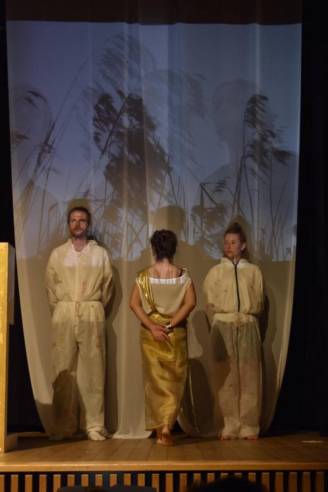
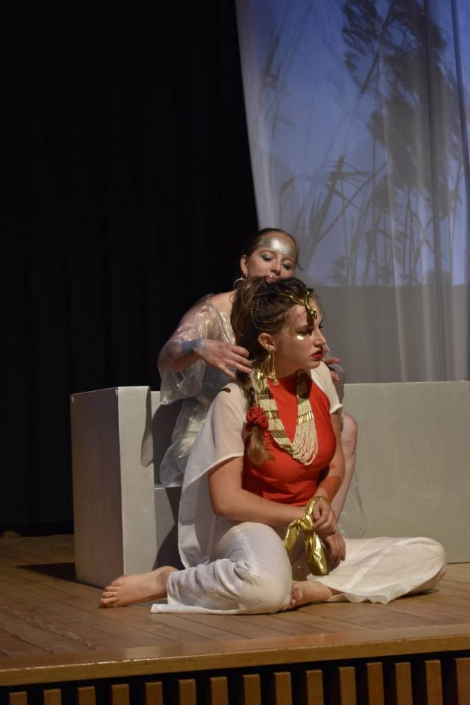

+++
title = 'Erstes Kostümprojekt'
date = 2021-03-21
draft = false
tags = ['Allgemein']
authot = 'Magda Lena Zehnder'
+++

Die Kostüme für die Oper «Giulio Cesare in Egitto» waren mein erstes Projekt auf der Bühne. Dabei habe ich zum ersten Mal gemerkt, wie viel spass es macht, sich in ein Stück zu vertiefen, sich in eine andere Zeit zu denken, sich zu überlegen mit welchem Detail man die beste Wirkung erziehlt.
 