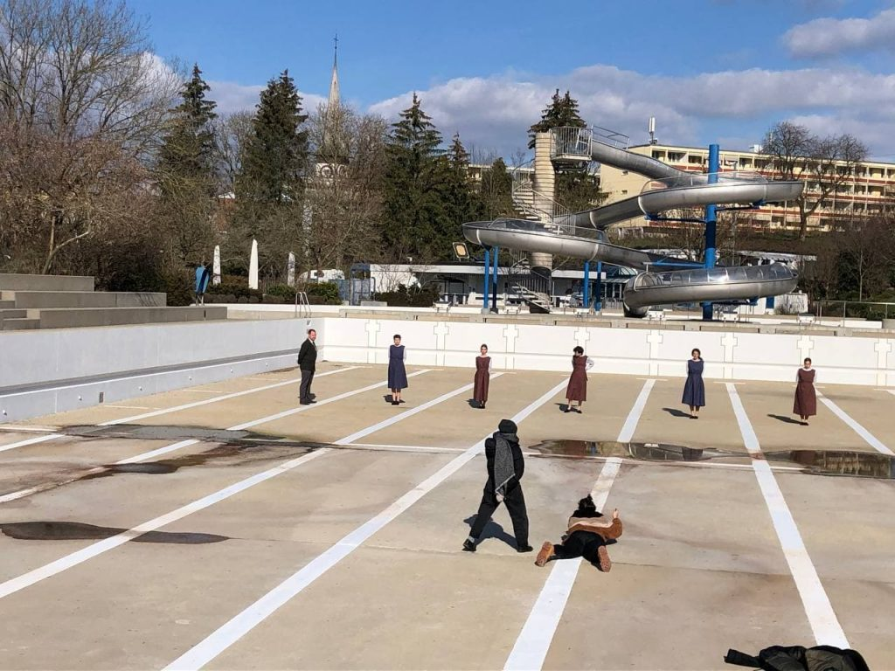

+++
title = 'Kostüme für «Hingubank»'
date = 2021-03-21
draft = false
tags = ['Allgemein']
authot = 'Magda Lena Zehnder'
+++

Das Theaterkollektiv Edit hat mich beauftragt für ihre Produktion «Hingubank» die Kostüme zu entwerfen, gestalten und umzusetzten. Das Stück spielt im Frauengefängnis Hindelbank von den 60er bis in die 80er Jahre und behandelt das Thema der administrativ Versorgten. Die Aufführungen finden im Juni 2021 im Tojo und im Kulturhof Köniz statt. Auf dem Bild sieht man den Gefängnisdirektor und die Insasinnen in ihren Kostümen bei einem Fotoshooting in der Badi in Köniz. 
